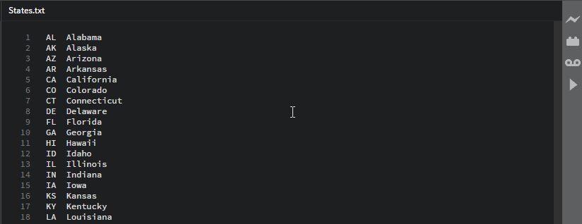

# brackets-macro-manager

An extension for creating and running macros in Adobe Brackets.

## What is it?
Macro-manager is an Adobe Brackets extension that allows you to record key strokes and play them back as many times as you like. This is a huge time saving tool when code needs many repetative changes that are a little more complicated than simple copy paste.

Let's say you have a list of the U.S. states and their abbreviations. You need this list put into a table in your database. Instead of painstakingly typing up an insert statement for all 50, you could do something like this:

## How does it work?
Recording can be triggered by pressing *Ctrl+Alt+F9*, selecting "Edit>Record Macro", or by clicking the tape record button  on the right toolbar. The tape record icon on the right toolbar will then turn red  indicating that keystrokes are being recorded. When you're done, the recording is then stopped the same way it was started.

This list of actions can then be "played back" or repeated programatically by pressing *Ctrl+Alt+F10*, selecting "Edit>Run Macro", or by clicking the triangular play button on the right toolbar. The macro will begin repeating the keystrokes the user made starting wherever the cursor is.

## How to install
Use Brackets built in Extension Manager or down load the "macro-manager" folder and place it in your user's brackets extension folder.

## Nuances and Known bugs
**Ignored Keys**

There are a number of keys that we don't actually want to record. These include keys like the Function keys (F1-F12), print screen and so on. The full list of currently ignored keys are:
Shift, Control, Alt, Pause/Break, Caps Lock, Page Up, Page Down, Print Screen, Windows/Mac Key, F1 - F12, Screen Lock.

The modifier keys (CTRL, SHIFT, ALT, etc) are stored as booleans in the KeyboardEvent object so we don't want to record them, we can pull the boolean on playback. The function keys usually contain program level commands so we don't want to be able to automate them. There are also some things we just can't or are really difficult to replicate like Page Up and Page Down. Aaand some other stuff I haven't gotten around to. 

**Clipboard Woes**

First of all, we don't have access to Brackets' or the OS's clipboard so each extension needs to create its own. This is done by listening for keypresses, keyup, or keydown events (pick your poison). The listener will simply wait for *Ctrl+c* and store the selected text from the Brackets Editor object.

There are some inherent problems with this:

    1. By the time any of the added events or listeners are fired, Brackets has already done it's thing. Meaning if the user presses CTRL+x for cut, Brackets has already added the selected text to the clipboard and removed it from the editor by the time the extension's listener is fired. The text is gone and can't be retrieved because we don't currently (OCT 2016) have access to the clipboard.

    2. Again, because we can't request the most recently copied object, we can only capture things that are copied *within an editor in Brackets*.

**Known Bugs**

If you find a bug, shoot me an email with the text you're working on and the keys you're pressing with a short blurb about what you're expecting to see. I'll get to it as soon as I can!

- Ctrl+x - this doesn't work and I don't really see a way to make it work until Brackets provides some sort of way to access the clipboard.
- There are some keys that may not act quite right. Since every keystroke needs to be programmed I couldn't test every possibility. Let me know if you find one.
- Pressing Shift+Home will work, but if it's already at the beginning of the line with blank space to the left it will flip the selection - This is an issue with the selections not maintaining cursor position when making selections
- Caps Lock doesn't work

## Next Steps and things to come
I'd like to clean up the code. A lot of it is kind of sloppy and I could condense a lot of functionality. As far as new things to come:
- Store macros in memory, maybe a txt file on the file system. Then macros can be saved and brought back when Brackets is closed and re-opened
- A manager window that provides the ability to name and save macros, select which macro you want to run, and possibly assign multiple macros to different key combinations

I'm open to suggestions!

## All that's well and good, but how does it *really* work?
Don't ask.
But since you did: It's actually a lot more complicated than it sounds and there are a lot of pitfalls when messing with the editor. 

**Simulating key events**
There is no easy way to programmatically "press" a key. Simply looping through and firing the key events will only make Brackets and other extensions *think* you pressed the key without actually writing anything to the editor window. This was particularly tricky when it came to arrow keys.

The editor does a lot that we take for granted. One for example is that if you are on a line with 20 characters and you hit the up key, the editor attempts to put the cursor at the 20th index. If the line is it's moved to is only 12 characters the cursor is put at the end of the line. This part is all handled by the editor when setCursorPos is called with the position object. However, if you press the up or down key again without pressing any other key, the cursor will move in that direction and again try to go to the 20th index. Well looping through an array of 70+ key presses, each being treated as its own event without any knowledge of what happened before it, is a painful game of logic and memory.

Basically each key press the user is made is programmatically mirrored in this extension. Key codes are checked, different actions are taken for Ctrl, Shift, and Alt for *each* key, and the document is updated appropriately.

If you're more interested in how it's done, shoot me an email.
